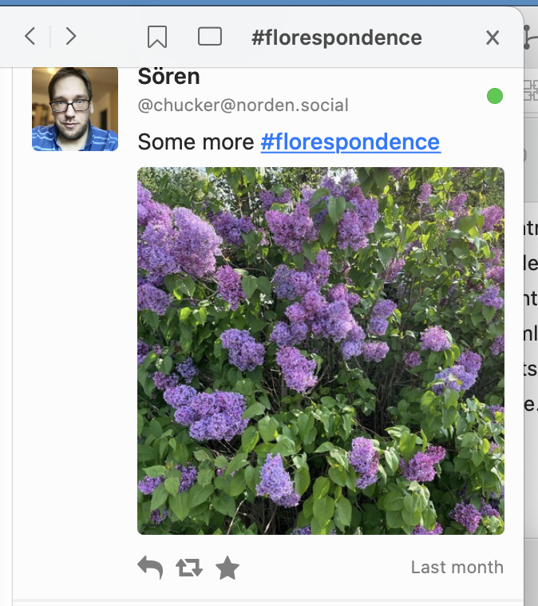
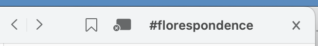

The **hashtag sidebar** shows when you click on a hashtag.

It lets you scroll through recent posts featuring the same hashtag. If you're interested, you can keep up with the hashtag in two ways, through the buttons at the top:

* **bookmark**ing a hashtag adds it to the menu bar, at **File** → **Bookmarked Tags**. (Note that bookmarked tags do not sync across different clients.)
 * **follow**ing a hashtag adds it to your Home timeline, just like following a person.

<figure>
    
    <figcaption>A hashtag sidebar, showing the florespondence hashtag (a portmanteau of flora and correspondence). In addition to the back/forward buttons, the title (the hashtag) and the close button, there are bookmark and follow buttons.</figcaption>
</figure>

The bookmark and follow buttons will invert if they're currently active. Clicking them again will un-bookmark or un-follow a hashtag.

<figure>
    
    <figcaption>A hashtag sidebar's header. This time, we're following the hashtag, so it shows as inverted.</figcaption>
</figure>
