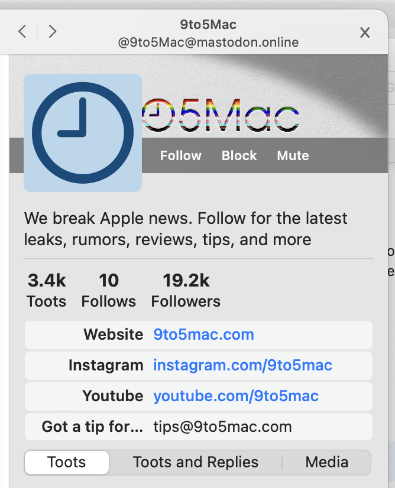

Sometimes, the main window expands to feature a **sidebar**. Unlike columns, you only see one sidebar at a time (per window), as this information is meant to be more transient.

Sidebars appear when you click on:

- [a user profile](UserProfile.html)
- [a hashtag](Hashtag.html)
- [a status](Status.html), revealing more details such as replies
- [a status's edits](StatusEdits.html), revealing the edit history
- [a user list](UserList.html), referring to related users

Sidebars are visually distinct in that they are always rightmost, and always feature at least back/forward buttons, a title, and a close button at their top.

<figure>
    
    <figcaption>A profile sidebar, showing the 9to5Mac profile. At the top left are back/forward buttons, in the top center their profile name, and at the top right a close button.</figcaption>
</figure>

As you navigate between different profiles or hashtags, the back/forward buttons let you go back (or forward). The close button dismisses the sidebar and focuses on your columns again.
